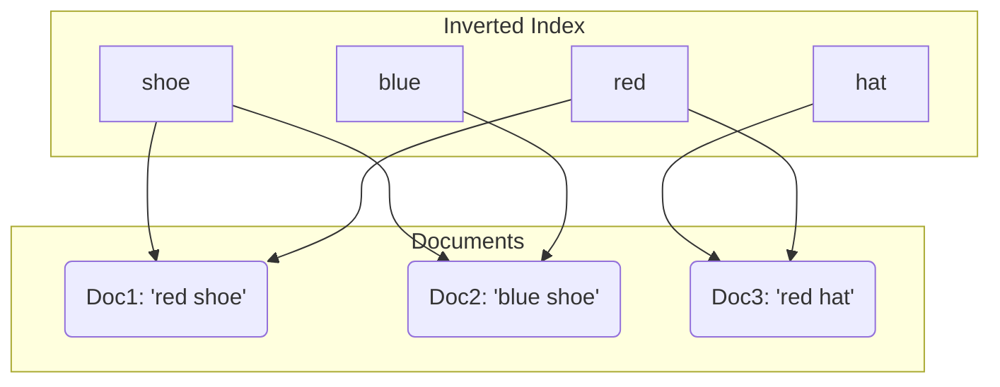
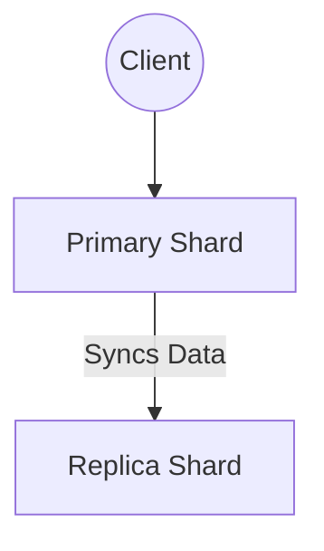
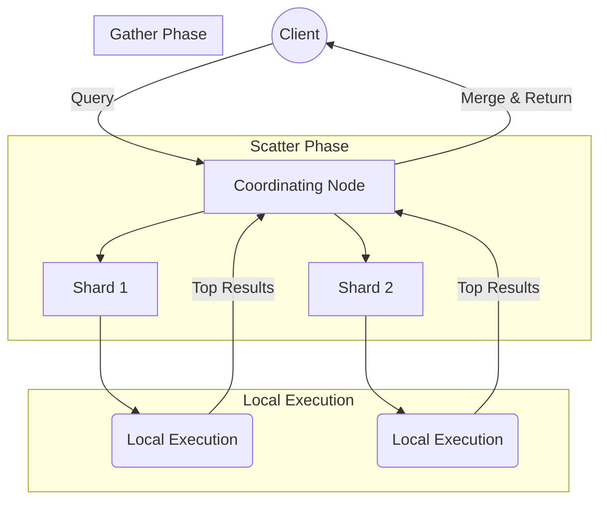
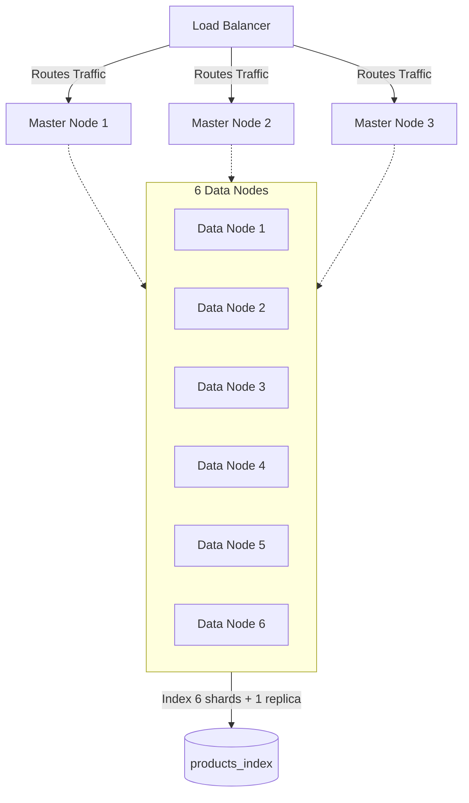

# Module 1: Introduction to Elasticsearch

## 1.1 What Problem Elasticsearch Solves
Relational databases are optimized for transactional consistency (ACID), structured queries, and row-based storage. They use B-tree indexes which are inefficient for unstructured full-text searches across large datasets. `LIKE '%shoe%'` queries force database scans. 

Elasticsearch is optimized for text searches, relevance ranking, large data volumes, and horizontal scaling. It uses an inverted index.

## 1.2 Lucene & Inverted Index Internals
Lucene is the core indexing engine. It tokenizes text, creates inverted indexes, stores segments, and scores relevance. An inverted index works by mapping terms (from a Term Dictionary) to Posting Lists of document IDs.

## 1.3 Core Data Model
- **Document** = JSON object
- **Field** = Key-value pair
- **Index** = Logical grouping
- **Mapping** = Defines data types

**Text vs Keyword Types**
Use `text` for full-text search (analyzed), and `keyword` for exact match filtering and aggregations (not analyzed).

## 1.4 Distributed Architecture
- **Master**: Manages cluster state
- **Data**: Stores shards
- **Ingest**: Preprocess data
- **Coordinating**: Routes requests

Master nodes update the cluster state and allocate shards. Writes go to the primary shard, and replicas synchronize afterwards.

## 1.5 Search Execution Flow
The Coordinating Node scatters the request across relevant shards (where local execution happens), gathers the local results, merges them, and returns them to the client.

## 1.6 Enterprise Case Study – E-Commerce

---

## Assigments
- [Proceed to Lab 1: JSON & REST API Basics](lab-1.md)
- [Proceed to Lab 2: Architecture Whiteboarding](lab-2.md)
