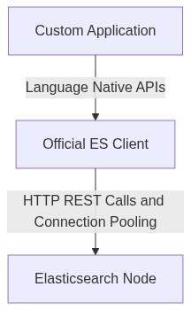
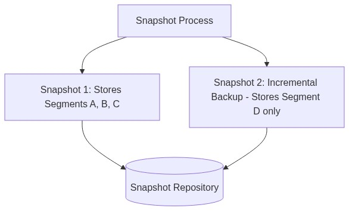
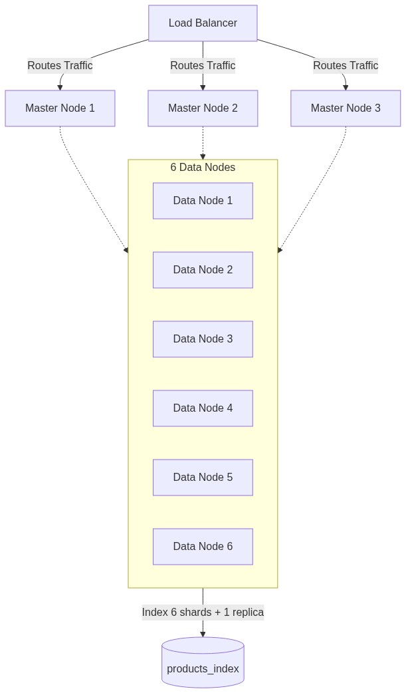
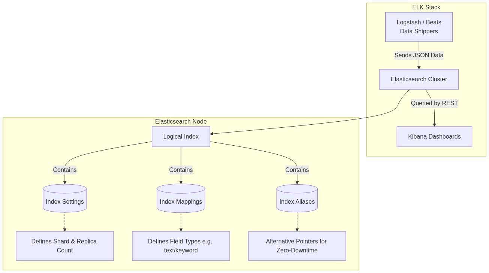

# Module 1: Architecture, Indices, Shards

## 1.1 What Problem Elasticsearch Solves
Relational databases are optimized for transactional consistency (ACID), structured queries, and row-based storage. They use B-tree indexes which are inefficient for unstructured full-text searches across large datasets. `LIKE '%shoe%'` queries force database scans. 

Elasticsearch is optimized for text searches, relevance ranking, large data volumes, and horizontal scaling. It uses an inverted index.

## 1.2 What is Apache Lucene?

Apache Lucene is the **open-source search library** that Elasticsearch is built on top of. Written in Java, Lucene handles the low-level mechanics of indexing and searching text. Understanding Lucene is key to understanding *why* Elasticsearch works the way it does.

**What Lucene Does:**
- **Tokenizes** raw text into individual terms (e.g., `"Running Shoes"` → `["running", "shoes"]`).
- **Builds an Inverted Index** that maps each term to the list of documents containing it (like a book's back-of-the-book index).
- **Stores data in immutable Segments** — once written, segments are never modified. Deletes are tracked as "tombstones" and cleaned up during background merges.
- **Scores relevance** using the BM25 algorithm (Best Matching 25), ranking results by term frequency, inverse document frequency, and field length.

**How Elasticsearch Builds on Lucene:**

```
┌─────────────────────────────────────────────────────┐
│                  Elasticsearch                       │
│  ┌──────────────────────────────────────────────┐   │
│  │  Distributed Layer (Clustering, Sharding,    │   │
│  │  Replication, REST API, Security, ILM)       │   │
│  └──────────────────────────────────────────────┘   │
│  ┌──────────────────────────────────────────────┐   │
│  │  Apache Lucene (Core Engine)                 │   │
│  │  Tokenizers, Inverted Index, Segments,       │   │
│  │  BM25 Scoring, Analyzers, Compression        │   │
│  └──────────────────────────────────────────────┘   │
└─────────────────────────────────────────────────────┘
```

| Feature | Lucene Provides | Elasticsearch Adds |
|---------|:---:|:---:|
| Full-text indexing & search | ✅ | — |
| BM25 relevance scoring | ✅ | — |
| Distributed clustering | — | ✅ |
| REST API (HTTP/JSON) | — | ✅ |
| Shard replication & failover | — | ✅ |
| Security (RBAC, TLS) | — | ✅ |
| Index Lifecycle Management | — | ✅ |
| Kibana visualization | — | ✅ |

*In short: Lucene is the search engine. Elasticsearch wraps it with distribution, REST APIs, security, and management — making it production-ready at scale.*

## 1.3 Inverted Index Internals

An inverted index works by mapping terms (from a Term Dictionary) to Posting Lists of document IDs. This is the opposite of a relational database's row-based storage.



## 1.4 Core Data Model
- **Document** = JSON object
- **Field** = Key-value pair
- **Index** = Logical grouping
- **Mapping** = Defines data types

**Text vs Keyword Types**
Use `text` for full-text search (analyzed), and `keyword` for exact match filtering and aggregations (not analyzed).

## 1.5 Distributed Architecture
- **Master**: Manages cluster state
- **Data**: Stores shards
- **Ingest**: Preprocess data
- **Coordinating**: Routes requests

Master nodes update the cluster state and allocate shards. Writes go to the primary shard, and replicas synchronize afterwards.



## 1.6 Search Execution Flow
The Coordinating Node scatters the request across relevant shards (where local execution happens), gathers the local results, merges them, and returns them to the client.


## 1.7 Enterprise Case Study – E-Commerce



## 1.8 Understanding Index Settings and Metadata

When you create an index (e.g., `my_test_index`), Elasticsearch generates metadata defining its configuration and internal state. Here is a breakdown of what each response field means:

```json
{
  "my_test_index": {
    "aliases": {},
    "mappings": {},
    "settings": {
      "index": {
        "routing": {
          "allocation": {
            "include": {
              "_tier_preference": "data_content"
            }
          }
        },
        "number_of_shards": "1",
        "provided_name": "my_test_index",
        "creation_date": "1772262791055",
        "number_of_replicas": "1",
        "uuid": "EA32-3rSQ96RrdSqYfUMew",
        "version": {
          "created": "8100499"
        }
      }
    }
  }
}
```

- **`aliases`**: Alternative names that point to this index. Crucial for zero-downtime reindexing architectures. For example, your app queries `logs_current`, which points to `my_test_index`, allowing you to swap the underlying index later without code changes.
  ```json
  "aliases": {
    "logs_current": {}
  }
  ```
- **`mappings`**: Defines the data schema for documents within the index. Empty until data is inserted or explicitly mapped.
  ```json
  "mappings": {
    "properties": {
      "user_name": { "type": "keyword" },
      "login_time": { "type": "date" }
    }
  }
  ```

#### How Index Settings fit into the ELK Stack


- **`settings.index.routing.allocation.include._tier_preference`**: Specifies the data tier (Hot, Warm, Cold) where shards are allocated. `data_content` is the default for standard generic data.
- **`settings.index.number_of_shards`**: Indicates the index is divided into 1 primary partition.
- **`settings.index.number_of_replicas`**: Indicates exactly 1 backup copy of each primary shard is expected (providing fault tolerance).
- **`settings.index.creation_date`**: UNIX epoch timestamp of when the index was created.
- **`settings.index.uuid`**: A globally unique identifier assigned to this specific index across the cluster.
- **`settings.index.version.created`**: The internal build version of Elasticsearch used when the index was constructed.

## 1.9 Elasticsearch Use Cases

Elasticsearch is used across industries for a wide variety of applications:

- **E-Commerce Search:** Power product catalogs with instant search, faceting, and auto-complete (e.g., Amazon product search).
- **Security / Security Information and Event Management (SIEM):** Analyze security logs and detect intrusions or anomalies in real-time using EQL sequence detection.
- **Real-Time Monitoring:** Collect and visualize infrastructure metrics, application logs, and performance data via Kibana dashboards.
- **Log Analytics:** Centralize logs from thousands of microservices for debugging, compliance, and root-cause analysis.
- **Full-Text Search:** Build fast search engines for websites, knowledge bases, and document repositories.

---

## Module 1 Quiz

**1. What open-source library is Elasticsearch built on top of?**
<details><summary>Answer</summary>Apache Lucene — a Java-based search library that handles tokenization, inverted indexing, and BM25 relevance scoring.</details>

**2. What is the difference between an inverted index and a traditional database index?**
<details><summary>Answer</summary>A traditional B-tree index maps row IDs to column values. An inverted index does the opposite: it maps each unique term to the list of document IDs that contain it, enabling fast full-text search.</details>

**3. A single-node cluster shows status "yellow". Is this a problem?**
<details><summary>Answer</summary>No. Yellow means all primary shards are assigned but replica shards are unassigned. With only 1 node, replicas cannot be placed on a different node, so yellow is expected and normal.</details>

**4. What is the difference between a `text` field and a `keyword` field?**
<details><summary>Answer</summary>`text` fields are analyzed (tokenized, lowercased) for full-text search. `keyword` fields are stored as-is for exact matching, sorting, and aggregations.</details>

**5. Name the four node roles in Elasticsearch.**
<details><summary>Answer</summary>Master (manages cluster state), Data (stores shards), Ingest (preprocesses data via pipelines), and Coordinating (routes requests and merges results).</details>

---

## Assignments
- [Proceed to Lab 1: Exploring JSON and REST APIs on Ubuntu](lab1.md)
- [Proceed to Lab 2: Starting a Temporary Dev Node via Tarball](lab2.md)

