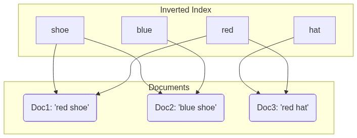
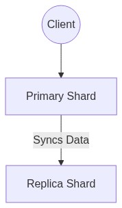
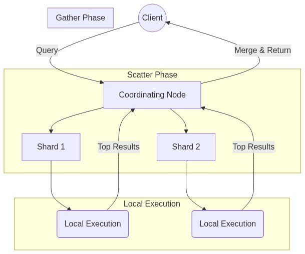

# Module 1: Architecture, Indices, Shards

## 1.1 What Problem Elasticsearch Solves
Relational databases are optimized for transactional consistency (ACID), structured queries, and row-based storage. They use B-tree indexes which are inefficient for unstructured full-text searches across large datasets. `LIKE '%shoe%'` queries force database scans. 

Elasticsearch is optimized for text searches, relevance ranking, large data volumes, and horizontal scaling. It uses an inverted index.

## 1.2 Lucene & Inverted Index Internals
Lucene is the core indexing engine. It tokenizes text, creates inverted indexes, stores segments, and scores relevance. An inverted index works by mapping terms (from a Term Dictionary) to Posting Lists of document IDs.



## 1.3 Core Data Model
- **Document** = JSON object
- **Field** = Key-value pair
- **Index** = Logical grouping
- **Mapping** = Defines data types

**Text vs Keyword Types**
Use `text` for full-text search (analyzed), and `keyword` for exact match filtering and aggregations (not analyzed).

## 1.4 Distributed Architecture
- **Master**: Manages cluster state
- **Data**: Stores shards
- **Ingest**: Preprocess data
- **Coordinating**: Routes requests

Master nodes update the cluster state and allocate shards. Writes go to the primary shard, and replicas synchronize afterwards.



## 1.5 Search Execution Flow
The Coordinating Node scatters the request across relevant shards (where local execution happens), gathers the local results, merges them, and returns them to the client.



## 1.6 Enterprise Case Study – E-Commerce


## 1.7 Understanding Index Settings and Metadata

When you create an index (e.g., `my_test_index`), Elasticsearch generates metadata defining its configuration and internal state. Here is a breakdown of what each response field means:

```json
{
  "my_test_index": {
    "aliases": {},
    "mappings": {},
    "settings": {
      "index": {
        "routing": {
          "allocation": {
            "include": {
              "_tier_preference": "data_content"
            }
          }
        },
        "number_of_shards": "1",
        "provided_name": "my_test_index",
        "creation_date": "1772262791055",
        "number_of_replicas": "1",
        "uuid": "EA32-3rSQ96RrdSqYfUMew",
        "version": {
          "created": "8100499"
        }
      }
    }
  }
}
```

- **`aliases`**: Alternative names that point to this index. Crucial for zero-downtime reindexing architectures. For example, your app queries `logs_current`, which points to `my_test_index`, allowing you to swap the underlying index later without code changes.
  ```json
  "aliases": {
    "logs_current": {}
  }
  ```
- **`mappings`**: Defines the data schema for documents within the index. Empty until data is inserted or explicitly mapped.
  ```json
  "mappings": {
    "properties": {
      "user_name": { "type": "keyword" },
      "login_time": { "type": "date" }
    }
  }
  ```

#### How Index Settings fit into the ELK Stack


- **`settings.index.routing.allocation.include._tier_preference`**: Specifies the data tier (Hot, Warm, Cold) where shards are allocated. `data_content` is the default for standard generic data.
- **`settings.index.number_of_shards`**: Indicates the index is divided into 1 primary partition.
- **`settings.index.number_of_replicas`**: Indicates exactly 1 backup copy of each primary shard is expected (providing fault tolerance).
- **`settings.index.creation_date`**: UNIX epoch timestamp of when the index was created.
- **`settings.index.uuid`**: A globally unique identifier assigned to this specific index across the cluster.
- **`settings.index.version.created`**: The internal build version of Elasticsearch used when the index was constructed.

---


## Assignments
- [Proceed to Lab 1: Exploring JSON and REST APIs on Ubuntu](lab1.md)
- [Proceed to Lab 2: Starting a Temporary Dev Node via Tarball](lab2.md)
