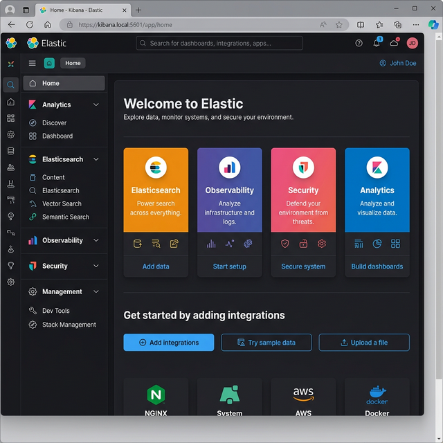

# Lab 4: Configuring Basic Security & Kibana Setup

## Goal
Establish secure interaction parameters by resetting the default superuser password and generating the security tokens required to link Kibana to the Elasticsearch node.

## Scenario
Kibana needs an enrollment token to securely pair with the database.

## Prerequisites
- Completion of Lab 3.
- Elasticsearch and Kibana MUST be installed on your Ubuntu VM.
- A modern web browser installed on your Ubuntu VM (e.g., Firefox, Chrome) or accessible from your host machine pointing to the VM.

## Instructions

1. **Start the Kibana Service:**
   ```bash
   sudo systemctl enable kibana.service
   sudo systemctl start kibana.service
   ```
   *Tip: Kibana takes between 1-3 minutes to fully initialize.*

2. **Generate a Kibana enrollment token:**
   ```bash
   sudo /usr/share/elasticsearch/bin/elasticsearch-create-enrollment-token -s kibana
   ```
   *(Copy this long string; you'll need it in the browser).*

3. **Retrieve the verification code:**
   ```bash
   sudo /usr/share/kibana/bin/kibana-verification-code
   ```

4. **Access the Kibana Web UI:**
   - Open a browser on your Ubuntu machine and navigate to: `http://localhost:5601`
   - Paste the enrollment token from Step 2 when prompted.
   - Enter the verification code from Step 3.
   - Log in using the username `elastic` and the password from Lab 3.

---

## Part 2: Core Kibana Navigation Options

As part of this course, you will primarily interact with Kibana's built-in applications. When you first log in or click the **Home** icon, you will see a landing page containing several major solutions and categories. Familiarize yourself with these core options:



1. **Elasticsearch:** Create search experiences with a refined set of APIs and tools.
2. **Observability:** Consolidate your logs, metrics, application traces, and system availability with purpose-built UIs.
3. **Security:** Prevent, collect, detect, and respond to threats for unified protection across your infrastructure.
4. **Analytics:** Explore, visualize, and analyze your data using a powerful suite of analytical tools and applications. (This includes **Discover** for raw KQL searching and **Dashboards** for visualizations).
5. **Management / Dev Tools:** Found at the bottom of the left navigation menu. **Dev Tools** provides the interactive console for writing raw JSON/REST queries against your cluster.

---

---
[Previous Lab: Lab 3](lab3.md) | [Return to Module 2](module2.md) | [Next Lab: Lab 5](lab5.md)
