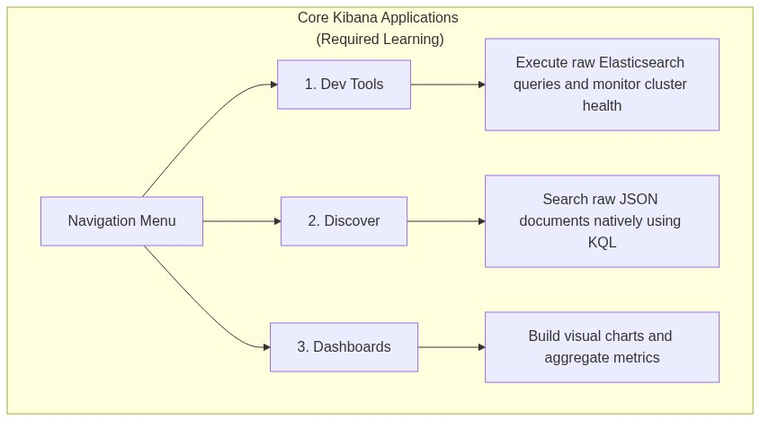

# Lab 4: Configuring Basic Security & Kibana Setup

## Goal
Establish secure interaction parameters by resetting the default superuser password and generating the security tokens required to link Kibana to the Elasticsearch node.

## Scenario
Kibana needs an enrollment token to securely pair with the database.

## Prerequisites
- Completion of Lab 3.
- Elasticsearch and Kibana MUST be installed on your Ubuntu VM.
- A modern web browser installed on your Ubuntu VM (e.g., Firefox, Chrome) or accessible from your host machine pointing to the VM.

## Instructions

1. **Start the Kibana Service:**
   ```bash
   sudo systemctl enable kibana.service
   sudo systemctl start kibana.service
   ```
   *Tip: Kibana takes between 1-3 minutes to fully initialize.*

2. **Generate a Kibana enrollment token:**
   ```bash
   sudo /usr/share/elasticsearch/bin/elasticsearch-create-enrollment-token -s kibana
   ```
   *(Copy this long string; you'll need it in the browser).*

3. **Retrieve the verification code:**
   ```bash
   sudo /usr/share/kibana/bin/kibana-verification-code
   ```

4. **Access the Kibana Web UI:**
   - Open a browser on your Ubuntu machine and navigate to: `http://localhost:5601`
   - Paste the enrollment token from Step 2 when prompted.
   - Enter the verification code from Step 3.
   - Log in using the username `elastic` and the password from Lab 3.

---

## Part 2: Core Kibana Applications to Learn

As part of this course, you will primarily interact with three built-in Kibana applications. Familiarize yourself with how to navigate to them using the global hamburger menu (☰).



1. **Dev Tools:** (Found under Management). The primary console for writing raw JSON/REST queries against the Elasticsearch cluster. Used to debug nodes, modify settings, and test manual queries.
2. **Discover:** (Found under Analytics). The primary search UI. Allows you to search through millions of documents interactively using the Kibana Query Language (KQL) without having to write raw JSON.
3. **Dashboards:** (Found under Analytics). The visualization engine. Allows you to build pie charts, line graphs, and data tables on top of your aggregations.

---

---
[Previous Lab: Lab 3](lab3.md) | [Return to Module 2](module2.md) | [Next Lab: Lab 5](lab5.md)
