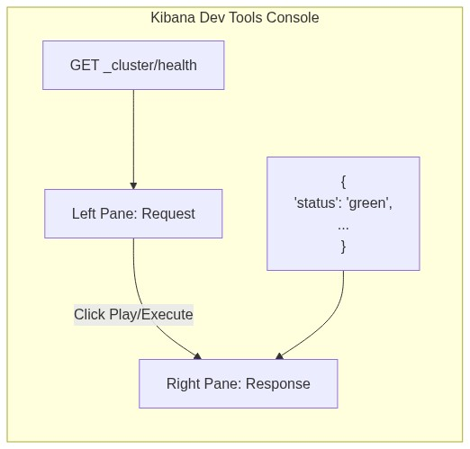

# Lab 5: Simulating & Advanced Troubleshooting

## Goal
Learn to navigate Kibana Dev Tools to intentionally break allocation rules, understand cluster status colors, and use APIs to diagnose node resources and thread pool rejections.

## Scenario
At 3:00 AM, the monitoring dashboard turns yellow, indicating the cluster is degraded. You need to identify *exactly* why shards are unassigned and ensure your node isn't running out of memory.

## Prerequisites
- Completion of Lab 4.
- Kibana must be running and accessible via your web browser.

---

## Part 1: Using Kibana Dev Tools

The **Dev Tools Console** is an interactive UI where you write Elasticsearch requests on the left pane, and the JSON responses appear on the right.

### 1. Access Dev Tools
- Open Kibana in your browser (`http://localhost:5601`).
- Open the left navigation menu (the "hamburger" icon ☰).
- Scroll down to the **Management** section and click **Dev Tools**.



### 2. How to Execute Commands
1. Type a command in the left pane (e.g., `GET _cluster/health`).
2. Place your text cursor anywhere on that line.
3. Click the green **Play (▶) button** that appears to the right of the command, or press `Ctrl + Enter` (`Cmd + Enter` on Mac).
4. Read the JSON response in the right pane.

---

## Part 2: Hands-On Troubleshooting

Below are the commands you will type into the left pane, and the expected output you will analyze in the right pane.

| Command (Type on Left Pane) | Expected Output (View on Right Pane) |
| :--- | :--- |
| **1. Check baseline health**<br><br>```json
GET _cluster/health
``` | Review the `"status"` field. It should currently be `"green"` since we have no complex indices yet.<br><br>```json
{
  "cluster_name": "elasticsearch",
  "status": "green",
  "unassigned_shards": 0
}
``` |
| **2. Break the rules**<br><br>Create an index demanding 1 Replica. Since you only have 1 Node, Elasticsearch cannot safely assign the duplicate data.<br><br>```json
PUT /troubleshoot_index
{ 
  "settings": {
    "number_of_replicas": 1 
  } 
}
``` | The cluster will accept the request and create the primary shard.<br><br>```json
{
  "acknowledged": true,
  "shards_acknowledged": true,
  "index": "troubleshoot_index"
}
``` |
| **3. Check degraded health**<br><br>```json
GET _cluster/health
``` | The cluster is now degraded because the replica couldn't be placed.<br><br>```json
{
  "cluster_name": "elasticsearch",
  "status": "yellow",
  "unassigned_shards": 1
}
``` |
| **4. Diagnose specifically WHY**<br><br>Ask the Allocation Explain API why the shard is unassigned.<br><br>```json
GET _cluster/allocation/explain
``` | Look inside the `"decisions"` array. You will see an explicit rejection reason:<br><br>```json
{
  "decider": "same_shard",
  "decision": "NO",
  "explanation": "the shard cannot be allocated to the same node on which a copy of the shard already exists"
}
```|
| **5. Check Node Resources**<br><br>Verify if your VM is running out of Heap Memory or Disk Space.<br><br>```json
GET _cat/nodes?v&h=name,heap.percent,ram.percent,cpu,disk.used_percent
``` | A tabular output will show your current resource utilization.<br><br>```text
name      heap.percent ram.percent cpu disk.used_percent
ubuntuvm            45          82   5                41
``` |
| **6. Verify Thread Pools**<br><br>If the UI is slow, check if the internal queues are rejecting tasks.<br><br>```json
GET _cat/thread_pool/search,write?v&h=node_name,name,active,queue,rejected
``` | A tabular output tracking active threads and dropped/rejected operations.<br><br>```text
node_name name   active queue rejected
ubuntuvm  search      0     0        0
ubuntuvm  write       0     0        0
``` |

---

[Previous Lab: Lab 4](lab4.md) | [Return to Module 2](module2.md) | [Next Lab: Lab 6](../module3/lab6.md)
