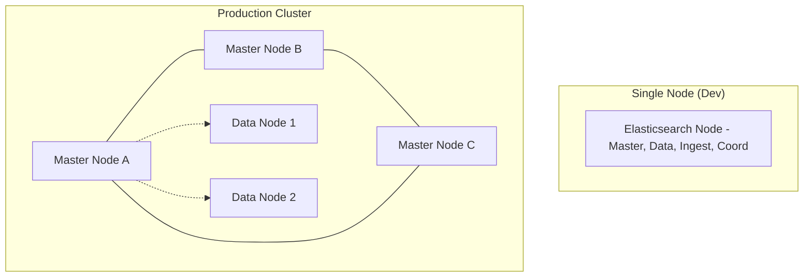
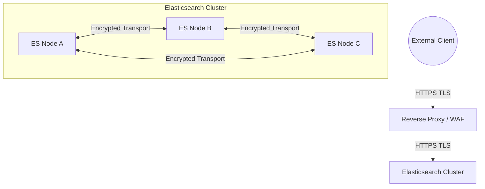
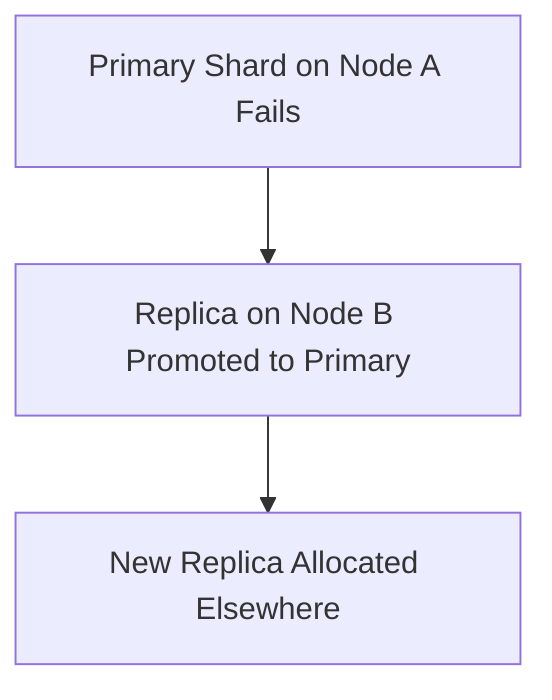

# Module 2: Installation, Security & High Availability

## 2.1 Development vs Production Setup
A Single Node is used for local development, lacking fault tolerance. A Production Cluster requires at least 3 master-eligible nodes to prevent split-brain scenarios. Bootstrap settings (`cluster.initial_master_nodes`, `discovery.seed_hosts`) are required to define how the cluster forms initially.

## 2.2 Security Architecture
- **Authentication & Authorization**: Identity verification and Role-Based Access Control (RBAC).
- **TLS Encryption**: Client to Node (HTTPS) and Node to Node communication should be encrypted.
- **API Keys**: For service-to-service communication and multi-tenant isolation.

## 2.4 High Availability & Fault Tolerance
Elasticsearch prevents "Split Brain" by requiring a quorum for cluster decisions (majority rules: e.g. 2 out of 3 master nodes).

**Cluster Health States:**
- **Green**: All shards assigned
- **Yellow**: Replica missing
- **Red**: Primary missing

**Replica Recovery Process:**

## 2.5 Rolling Upgrade Strategy
Rolling upgrades allow zero downtime in production environments. The cycle is:
1. Disable shard allocation.
2. Stop one node.
3. Upgrade the version.
4. Start the node.
5. Re-enable allocation.
6. Repeat for all nodes.

---

## Assigments
- [Proceed to Lab 3: Installing Elasticsearch & Kibana on Ubuntu](lab3.md)
- [Proceed to Lab 4: Configuring Basic Security](lab4.md)
