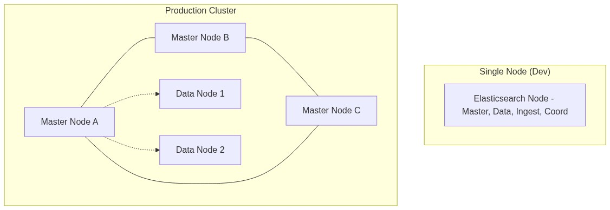
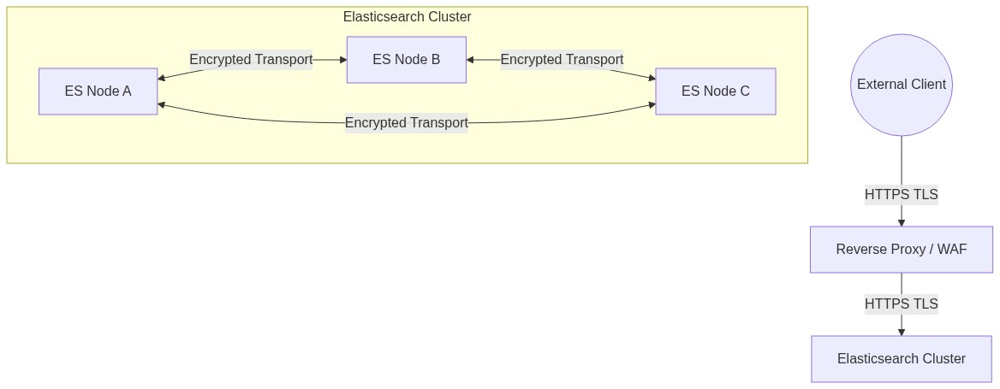
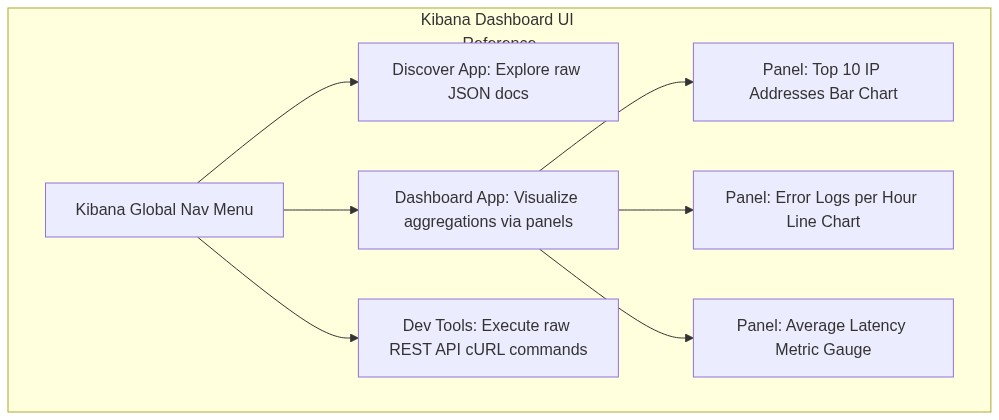
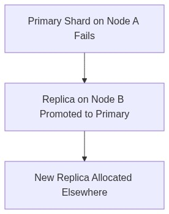
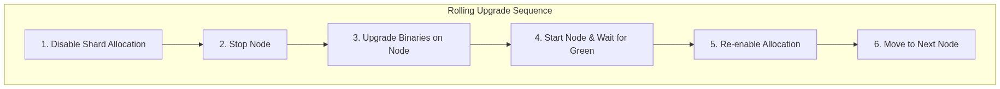

# Module 2: HA Clusters, Troubleshooting, Upgrading

## 2.1 Development vs Production Setup
A Single Node is used for local development, lacking fault tolerance. A Production Cluster requires at least 3 master-eligible nodes to prevent split-brain scenarios. Bootstrap settings (`cluster.initial_master_nodes`, `discovery.seed_hosts`) are required to define how the cluster forms initially.

## 2.2 Security Architecture
- **Authentication & Authorization**: Identity verification and Role-Based Access Control (RBAC).
- **TLS Encryption**: Client to Node (HTTPS) and Node to Node communication should be encrypted.
- **API Keys**: For service-to-service communication and multi-tenant isolation.

## 2.3 Kibana UI Overview
Kibana provides the visualization layer. **Discover** is used for searching index data interactively. **Dashboards** aggregate complex Metrics and Bucket data. **Dev Tools** allows raw Elasticsearch query execution.

## 2.4 High Availability & Fault Tolerance

**What is a Split-Brain Scenario?**
A "Split-Brain" occurs when a network partition causes a cluster to divide into two disconnected halves. If both halves elect their own Master node, they will independently accept conflicting writes. When the network heals, the two halves cannot be merged without massive data loss.
Elasticsearch prevents Split-Brain by enforcing strict **quorum** rules. A cluster requires a strict majority of master-eligible nodes `(N/2) + 1` to be visible before any Master is elected. If an isolated subset loses quorum, they refuse to elect a Master and halt all writes, protecting data integrity.

**Cluster Health States:**
- **Green**: All shards assigned
- **Yellow**: Replica missing
- **Red**: Primary missing

**Replica Recovery Process:**

## 2.5 Rolling Upgrade Strategy
Rolling upgrades allow zero downtime in production environments. The cycle is:
1. Disable shard allocation.
2. Stop one node.
3. Upgrade the version.
4. Start the node.
5. Re-enable allocation.
6. Repeat for all nodes.

## 2.6 Troubleshooting Concepts

- **Unassigned Shards**: Typically due to absent data nodes (hardware crashes) or allocating too many replica settings. Check `GET _cluster/allocation/explain`.
- **Slow Queries**: Inspect the slow logs, check for large string scripts being evaluated on every document, and verify that you aren't trying to do heavy sorting on `text` rather than `keyword` doc values.
- **High Heap Usage**: Often caused by "Mapping Explosions" (too many dynamic unique keys) or misusing fielddata un-aggregated.

---

## Assignments
- [Proceed to Lab 3: Installing Elasticsearch & Kibana on Ubuntu](lab3.md)
- [Proceed to Lab 4: Configuring Basic Security & Kibana Setup](lab4.md)
- [Proceed to Lab 5: Simulating & Advanced Troubleshooting](lab5.md)

## 2.5 Enterprise Search Server

An Enterprise Search Server provides scalable, unified search capabilities across multiple organizational data sources:

- **Federated Search:** Search across databases, file shares, cloud storage, and SaaS applications from a single query.
- **App Search:** Build custom, relevance-tuned search experiences for customer-facing applications.
- **Workplace Search:** Enable employees to search internal knowledge bases, wikis, emails, and documents from one interface.
- **Relevance Tuning:** Adjust search result ranking using curations, synonyms, and boost rules without code changes.
