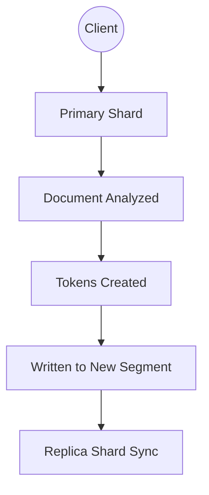
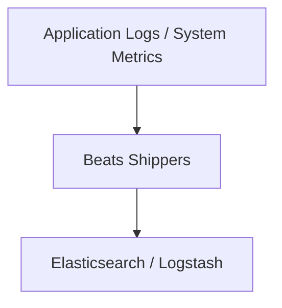
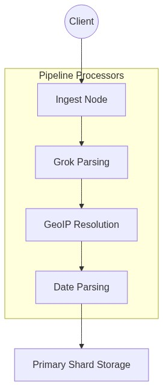
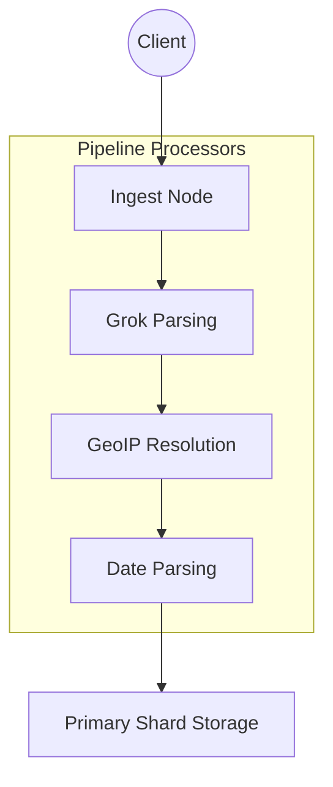

# Module 3: Data Ingestion, Logstash, Beats

## 3.1 Indexing Internals
Indexing is near real-time. Documents are written to a memory buffer and flushed down. A **Refresh Cycle** (default 1 second cycle) makes new documents searchable immediately. 

Eventually, memory buffer data is merged in the background. **Segments are immutable.** Updates are handled by deprecating old documents and storing new ones.

## 3.2 Bulk API
The Bulk API enables high throughput by batching multiple operations in one HTTP request. It reduces HTTP overhead at the cost of slightly higher latency per document. Used widely in production indexing workloads.

## 3.3 Logstash Architecture

Logstash acts as an ETL (Extract, Transform, Load) pipeline. It reads from inputs, applies filters, and routes data to outputs.

## 3.4 Beats Architecture
Lightweight data shippers.
- **Filebeat**: Logs
- **Metricbeat**: Metrics
- **Packetbeat**: Network traffic

## 3.5 Ingest Pipelines

Use Ingest Pipelines within Elasticsearch to process data without leveraging external tools like Logstash. Common Processors include Grok, GeoIP, Date, Set, and Rename.

## 3.6 Mapping Strategy
Dynamic Mapping automatically maps new JSON properties, but runs the risk of "Mapping Explosions", ballooning field metadata and killing cluster performance. Prefer explicit mappings for production systems to avoid unintended field expansions.

Use `Fielddata` for full-text fields being used in aggregations (carefully, since it eats heap overhead), and use `Doc Values` (columnar storage mapping) for sorting/aggregating keyword fields.

---

## Assignments
- [Proceed to Lab 6: Indexing Data via Bulk API](lab6.md)
- [Proceed to Lab 7: Installing Filebeat & Logstash](lab7.md)
- [Proceed to Lab 8: Explicit Mappings & Ingest Pipelines](lab8.md)

## 3.5 Connectors & Web Crawlers

**Connectors** allow Elasticsearch to integrate with external data sources for automatic indexing:
- **JDBC Connector:** Index data from relational databases (MySQL, PostgreSQL, Oracle).
- **SharePoint/Confluence Connector:** Index content from enterprise collaboration tools.
- **Cloud Connectors:** Pull data from AWS S3, Google Drive, OneDrive, and other cloud platforms.

**Web Crawlers** automatically discover, fetch, and index content from websites:
- Configure starting URLs and crawl rules (include/exclude patterns).
- Extract text, metadata, and links for full-text searchability.
- Schedule periodic re-crawls to keep content up to date.
