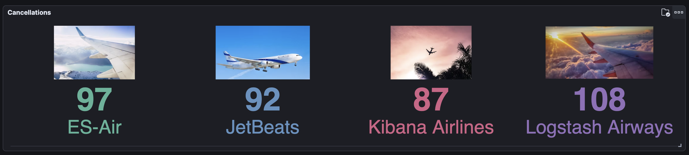

# Lab 10: Aggregations Framework

## Goal
Nest a Metrics Aggregation inside a Bucket Aggregation to perform live mathematical analytics over grouped data.

## Scenario
The business team wants to know the average price of products, but separated out by Category.

## Prerequisites
- Completion of Lab 11 (The `products` index must exist).
- You must be logged into the Kibana Web UI and have the Dev Tools console open.

## Instructions

### Part 0: Insert Sample Data
Ensure you have the following data for aggregations:
```json
POST /sales/_bulk
{"index":{}}
{"product": "Laptop", "category": "Electronics", "price": 1200, "date": "2023-10-01"}
{"index":{}}
{"product": "Mouse", "category": "Electronics", "price": 25, "date": "2023-10-02"}
{"index":{}}
{"product": "Chair", "category": "Furniture", "price": 150, "date": "2023-10-01"}
```

*(Navigate to **Management -> Dev Tools** in Kibana).*

1. **Build a Bucket + Metrics Aggregation:**
   - We use `terms` to create a bucket for each unique `category`.
   - We nest an `avg` aggregation inside the bucket to calculate the mean `price`.
   - We set `"size": 0` because we only care about the math results, not the actual product JSON documents.

   ```json
   GET products/_search
   {
     "size": 0,
     "aggs": {
       "categories": {
         "terms": { "field": "category.keyword" },
         "aggs": {
           "avg_price": { "avg": { "field": "price" } }
         }
       }
     }
   }
   ```

2. **Analyze the Results:**
   Scroll down the response pane past the empty `"hits"` array to the `"aggregations"` block. You'll see an array of buckets (e.g., `Accessories`, `Footwear`) displaying their respective document counts and average prices.

   *Note: In a true production environment, these raw JSON aggregations are rendered visually in Kibana Dashboards, like the example below:*
   

---

---

---
[Previous Lab: Lab 9](lab9.md) | [Return to Module 4](module4.md) | [Next Lab: Lab 11](lab11.md)
