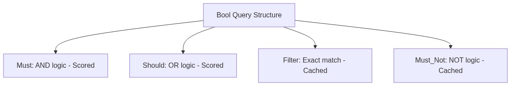
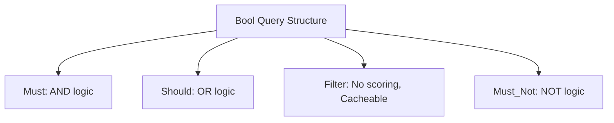
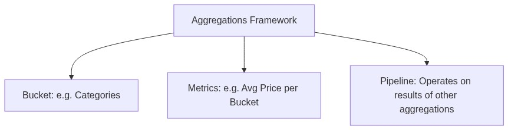
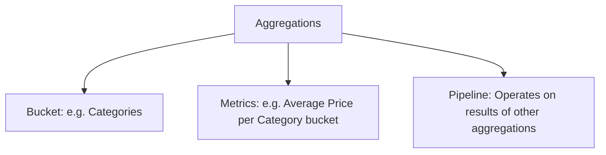

# Module 4: Search DSL, ES|QL, EQL, SQL

## 4.1 Query Context vs Filter Context

- **Query Context**: Used in `must` or `should`. Calculates a relevance score (BM25). Slower.
- **Filter Context**: Used in `filter`. Does not apply relevance scoring. Exact matches only. Faster because queries can be cached by Elasticsearch.

## 4.2 Full-Text Search Internals
- **Tokenizers**: Chop text into individual words based on punctuation or whitespace.
- **Analyzers**: Includes the Tokenizer, but also applies Character Filters (e.g. removing HTML tags) and Token Filters (e.g. converting to lowercase, stemming words like "sneakers" to "shoe", or expanding synonyms).

## 4.3 BM25 Ranking
BM25 stands for Best Matching 25. It ranks search relevance based on 3 factors:
1. **Term Frequency (TF)**: How often the search term appears in the document field. (Higher = Better)
2. **Inverse Document Frequency (IDF)**: How rare the search term is across the entire corpus. (Rarer = Better)
3. **Field Length Normalization**: Short fields containing the term score higher than long fields.

## 4.4 Aggregations Framework

Aggregations gather data into groups and perform calculations on those groups.
- **Bucket Aggregation**: Groups documents (e.g. `terms`, `date_histogram`). Similar to `GROUP BY` in SQL.
- **Metrics Aggregation**: Calculates math values (e.g. `avg`, `sum`, `max`).

## 4.5 ES|QL, EQL, and SQL
- **ES|QL**: A pipeline processing language designed specifically for real-time analytics. Combines filtering, sorting, joins, and time-series logic.
- **EQL**: Event Query Language. Built specifically for detecting behavioral sequences across events (common in security SIEMs).
- **SQL**: Standard relational querying. Allows you to bridge the gap with existing systems that only understand JDBC/SQL.

---

## Module 4 Quiz

**1. What is the difference between Query Context and Filter Context?**

Answer
Query Context (`must`/`should`) calculates a relevance score using BM25. Filter Context (`filter`) is a binary yes/no match with no scoring, making it faster and cacheable.

**2. What does ES|QL's pipe (`|`) syntax do?**

Answer
It chains processing stages sequentially — data flows left to right through operations like `FROM`, `WHERE`, `STATS`, `SORT`, and `LIMIT`, similar to Unix shell pipes.

**3. What type of query would you use in EQL to detect a brute-force login attack?**

Answer
A `sequence` query — it identifies ordered patterns across events, such as "2 failed logins followed by 1 successful login from the same user."

**4. In an aggregation query, what is the difference between a Bucket and a Metrics aggregation?**

Answer
Bucket aggregations group documents into categories (like SQL `GROUP BY`). Metrics aggregations calculate math values (avg, sum, max) over those groups.

**5. What does `"profile": true` do in a search request?**

Answer
It attaches a detailed timing breakdown to the response, showing exactly how many nanoseconds each Lucene operation took. Used to diagnose slow queries.

---

## Assignments
- [Proceed to Lab 10: Query vs. Filter Contexts](lab10.md)
- [Proceed to Lab 11: Aggregations Framework](lab11.md)
- [Proceed to Lab 12: Building Kibana Dashboards](lab12.md)
- [Proceed to Lab 13: Analyzing Search Performance](lab13.md)
- [Proceed to Lab 14: Querying with ES|QL, EQL, and SQL](lab14.md)

## 4.6 Search Applications

Search Applications provide a unified API layer for building search-powered UIs:
- Create search endpoints with pre-defined relevance rules.
- Apply query parameters, filters, and facets without exposing raw Elasticsearch DSL.
- Integrate with frontend frameworks via simple REST calls.

## 4.7 Machine Learning in Search

Elasticsearch integrates with ML tools to enhance search capabilities:
- **Semantic Search:** Understand user intent beyond exact keyword matching using vector embeddings.
- **Anomaly Detection:** Identify unusual patterns in time-series data automatically.
- **Query Expansion:** Suggest alternative or related queries based on user behavior.
- **Auto-Completion:** Predict and suggest search terms as users type, improving the search experience.
