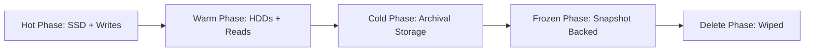
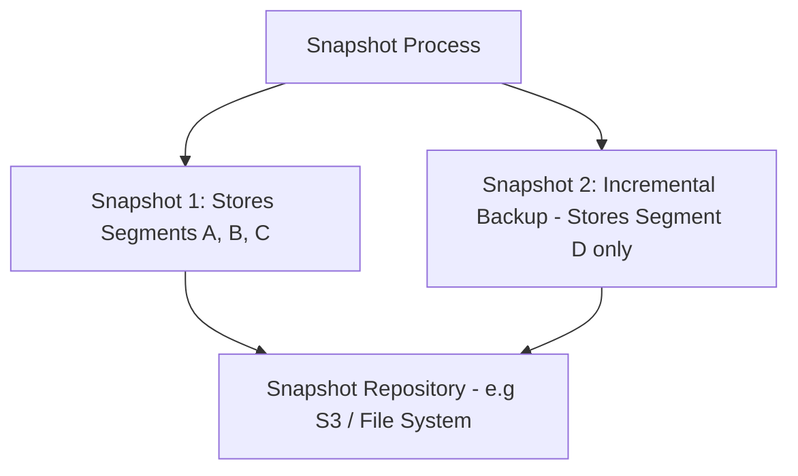

# Module 5: ILM, Down-sampling/Rollups, Snapshots

## 5.1 Index Lifecycle Management (ILM)

Automates moving data through a pipeline to reduce storage costs.

- **Hot Phase**: Active indexing/writes. High CPU and fast SSDs required.
- **Warm Phase**: Read-heavy, fewer writes. Optimizes segment sizes.
- **Cold Phase**: Rare access. Optimized purely for storage cost.
- **Frozen Phase**: Snapshot-based searchable storage.
- **Delete Phase**: Wipes the index physically from the cluster.

## 5.2 Downsampling & Rollups
Massive time-series data streams (like CPU metrics per second) become too large over time. **Downsampling** via rollup jobs summarizes these records into lower-resolution aggregates (e.g. keeping Min/Max/Avg values per minute or hour).

## 5.3 Snapshots & Restore

A snapshot captures the cluster state, metadata, and the Lucene segments inside the indices.

Snapshots are incrementally based on immutability. Only newly created segments are copied. They can be stored in basic filesystems or natively in S3/Azure/GCP blob storage.

## 5.4 Segment Merging and Compression
Since Lucene segments are immutable, deleting or updating a document simply marks an old revision as "deleted". **Background Merges** clean up these dead documents and squish small segments into big segments to make searches faster. You can manage disk space by tweaking LZ4 compression or enabling `best_compression`.

Heap sizes should never exceed 50% of the OS RAM, and normally cap out at 32GB to maintain compressed OOPs in the JVM.

---

## Module 5 Quiz

**1. Name the 5 phases in an ILM policy, in order.**

Answer
Hot → Warm → Cold → Frozen → Delete. Each phase optimizes for different access patterns and cost tradeoffs.

**2. What is the difference between a regular index and a Data Stream?**

Answer
A Data Stream is append-only, requires a `@timestamp` field, automatically creates and rotates backing indices, and supports transparent multi-index search. Regular indices support updates and deletes.

**3. Why are Elasticsearch snapshots "incremental"?**

Answer
Because Lucene segments are immutable. Once a segment is backed up in Snapshot 1, Snapshot 2 only needs to copy newly created segments, making subsequent backups much faster and smaller.

**4. What is Downsampling and when would you use it?**

Answer
Downsampling aggregates granular time-series data (e.g., per-second CPU metrics) into summarized records (e.g., per-minute averages). Used to reduce storage costs for historical data while preserving analytical value.

**5. What does `"is_write_index": true` mean in an ILM rollover alias?**

Answer
It designates which backing index currently receives new writes. When a rollover occurs, a new index is created and becomes the new write index, while the old one becomes read-only.

---

## Assignments
- [Proceed to Lab 15: Implementing Index Lifecycle Management (ILM)](lab15.md)
- [Proceed to Lab 16: Working with Data Streams](lab16.md)
- [Proceed to Lab 17: Configuring Local Snapshots](lab17.md)
- [Proceed to Lab 18: Downsampling Time-Series Data](lab18.md)
