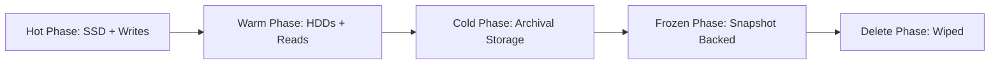
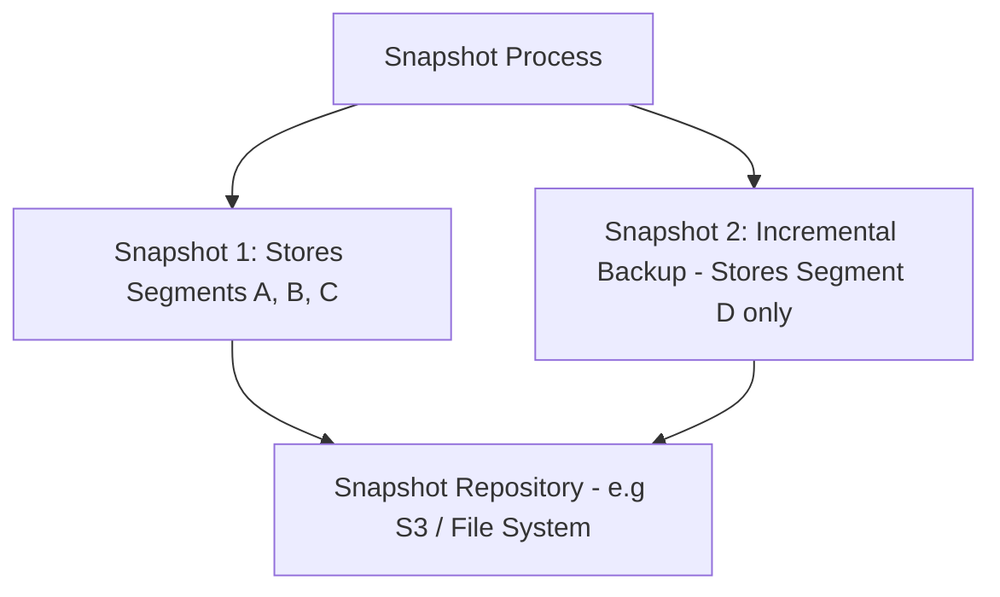

# Module 5: ILM, Down-sampling/Rollups, Snapshots

## 5.1 Index Lifecycle Management (ILM)
Automates moving data through a pipeline to reduce storage costs.

- **Hot Phase**: Active indexing/writes. High CPU and fast SSDs required.
- **Warm Phase**: Read-heavy, fewer writes. Optimizes segment sizes.
- **Cold Phase**: Rare access. Optimized purely for storage cost.
- **Frozen Phase**: Snapshot-based searchable storage.
- **Delete Phase**: Wipes the index physically from the cluster.

## 5.2 Downsampling & Rollups
Massive time-series data streams (like CPU metrics per second) become too large over time. **Downsampling** via rollup jobs summarizes these records into lower-resolution aggregates (e.g. keeping Min/Max/Avg values per minute or hour).

## 5.3 Snapshots & Restore
A snapshot captures the cluster state, metadata, and the Lucene segments inside the indices.

Snapshots are incrementally based on immutability. Only newly created segments are copied. They can be stored in basic filesystems or natively in S3/Azure/GCP blob storage.

## 5.4 Segment Merging and Compression
Since Lucene segments are immutable, deleting or updating a document simply marks an old revision as "deleted". **Background Merges** clean up these dead documents and squish small segments into big segments to make searches faster. You can manage disk space by tweaking LZ4 compression or enabling `best_compression`.

Heap sizes should never exceed 50% of the OS RAM, and normally cap out at 32GB to maintain compressed OOPs in the JVM.

---

## Assignments
- [Proceed to Lab 12: Implementing Index Lifecycle Management (ILM)](lab12.md)
- [Proceed to Lab 13: Configuring Local Snapshots](lab13.md)
