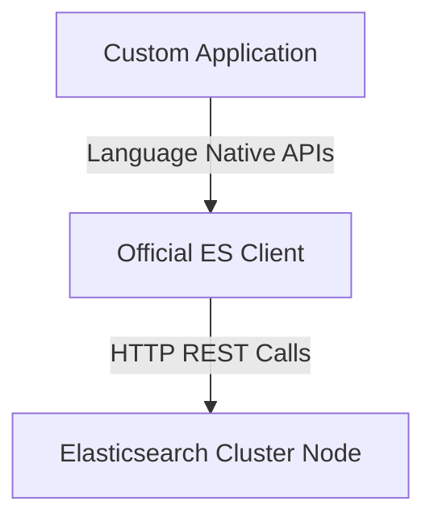
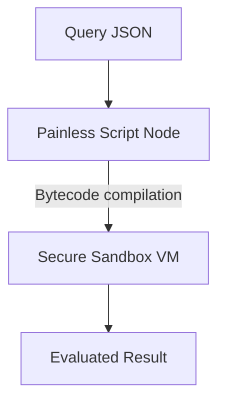

# Module 6: REST APIs, Clients, Painless Scripting

## 6.1 REST API Philosophy
Every interaction with Elasticsearch goes through HTTP REST verbs:
- `GET`: Retrieve documents or cluster states.
- `POST`: Create entirely new documents via automated IDs, or execute searches.
- `PUT`: Overwrite existing documents or create indices.
- `DELETE`: Remove indices or documents.

## 6.2 Official Client Architecture

Official clients exist for Java, Python, Node.js, Go, and .NET. Instead of forcing you to format raw JSON or track endpoints natively, these libraries handle:
- Connection pooling
- Node retries on failure
- Serialization to native classes/objects

## 6.3 Painless Scripting Internals
**Painless** is a secure, sandboxed scripting language native to Elasticsearch. Built resembling Java, it lets you:
- Dynamically manipulate data inside Update APIs (e.g. `ctx._source.price += 10`).
- Implement custom scoring functions in search relevance loops.
- Avoid large overhead via compiled bytecode caching.

## Module 6 Quiz

**1. What are the 4 core HTTP verbs used by Elasticsearch's REST API?**

Answer
GET (retrieve), POST (create/search), PUT (create/overwrite), DELETE (remove). Every Elasticsearch interaction uses one of these verbs.

**2. Why should you use parameterized variables in Painless scripts instead of hardcoded values?**

Answer
Parameterized scripts allow Elasticsearch to compile the script once and cache the bytecode. If you hardcode values, a new compilation is needed for each unique value, wasting CPU.

**3. What does the `_cat/indices?v` API return?**

Answer
A human-readable table showing all indices with their health status, document count, store size, number of primary shards, and replicas.

**4. What is the `analysis-icu` plugin used for?**

Answer
It provides the ICU Analyzer for proper Unicode text analysis, especially important for CJK (Chinese, Japanese, Korean) languages where the standard analyzer tokenizes each character individually.

**5. Name 3 advantages of using an official Elasticsearch client library (e.g., `elasticsearch-py`) over raw `curl` commands.**

Answer
1) Connection pooling for performance, 2) Automatic retry on node failure, 3) Native serialization to language objects (no manual JSON formatting).

---

## Assignments
- [Proceed to Lab 19: Using Painless Scripts](lab19.md)
- [Proceed to Lab 20: REST API Deep Dive & Python Client](lab20.md)
- [Proceed to Lab 21: Installing and Managing Plugins](lab21.md)
