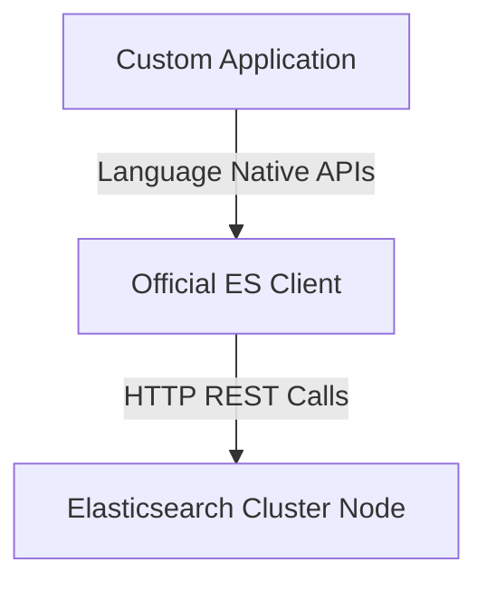
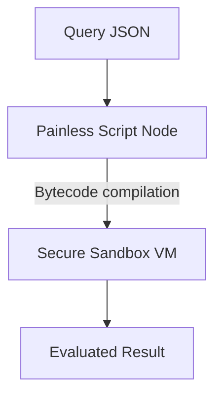

# Module 6: APIs, Clients & Advanced Topics

## 6.1 REST API Philosophy
Every interaction with Elasticsearch goes through HTTP REST verbs:
- `GET`: Retrieve documents or cluster states.
- `POST`: Create entirely new documents via automated IDs, or execute searches.
- `PUT`: Overwrite existing documents or create indices.
- `DELETE`: Remove indices or documents.

## 6.2 Official Client Architecture
Official clients exist for Java, Python, Node.js, Go, and .NET. Instead of forcing you to format raw JSON or track endpoints natively, these libraries handle:
- Connection pooling
- Node retries on failure
- Serialization to native classes/objects

## 6.3 Painless Scripting Internals
**Painless** is a secure, sandboxed scripting language native to Elasticsearch. Built resembling Java, it lets you:
- Dynamically manipulate data inside Update APIs (e.g. `ctx._source.price += 10`).
- Implement custom scoring functions in search relevance loops.
- Avoid large overhead via compiled bytecode caching.

## 6.4 Troubleshooting Concepts

- **Unassigned Shards**: Typically due to absent data nodes (hardware crashes) or allocating too many replica settings. Check `GET _cluster/allocation/explain`.
- **Slow Queries**: Inspect the slow logs, check for large string scripts being evaluated on every document, and verify that you aren't trying to do heavy sorting on `text` rather than `keyword` doc values.
- **High Heap Usage**: Often caused by "Mapping Explosions" (too many dynamic unique keys) or misusing fielddata un-aggregated.

---

## Assigments
- [Proceed to Lab 13: Using Painless Scripts](lab13.md)
- [Proceed to Lab 14: Simulating & Troubleshooting Cluster Issues](lab14.md)
