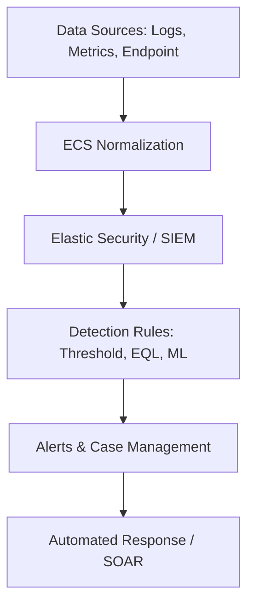

# Module 7: Advanced Use Cases & Day 2 Operations

## Overview
This module explores expert-level Elasticsearch use cases, taking you beyond basic ingestion and search. We cover security threat hunting, active application debugging, and "Day 2" operations — the critical tasks required to keep a production cluster healthy, performant, and resilient.

## 7.1 Security Threats Analysis
Security analysis in the Elastic Stack leverages the **Elastic Common Schema (ECS)** to normalize data across different sources (Logs, Netflow, Endpoint).
- **Brute Force Detection**: Using ES|QL to identify spikes in authentication failures per IP.
- **Sequence Analysis**: Using EQL (Event Query Language) to identify multi-stage attacks (e.g., successful login after multiple failures).
- **Threat Hunting**: Proactive searching across logs, metrics, and netflow data to identify indicators of compromise (IoC).
- **SIEM (Security Information and Event Management)**: Elastic Security provides a unified platform for SIEM, including detection rules, timeline analysis, and case management. It centralizes visibility across the entire infrastructure to detect, investigate, and respond to threats.

## 7.2 Alerting and Rules
Elasticsearch and Kibana provide a robust framework for responding to events in real-time.
- **Index Threshold Rules**: Trigger when a metric (e.g., CPU) exceeds a limit.
- **Detection Rules**: Built-in Security Information and Event Management (SIEM) rules for identifying known malicious behavior patterns. These rules are managed within the **Security > Rules** engine in Kibana v8.x.
- **Connectors**: Automated actions like sending Slack messages, Emails, or PagerDuty alerts.

## 7.3 Anomaly Detection
Beyond static thresholds, Elasticsearch uses Machine Learning to identify "what's not normal" by learning historical baselines.
- **Unsupervised Learning**: Automatically identifies trends and seasonal patterns in time-series data without requiring manual thresholds.
- **Scoring Anomalies**: Each anomaly is assigned a score (0-100) based on how unusual it is compared to historical patterns. Scores above 75 are typically considered critical.
- **AIOps**: Using ML to assist in root-cause analysis by correlating spikes across different services and identifying the "rare" events that preceded an incident.
